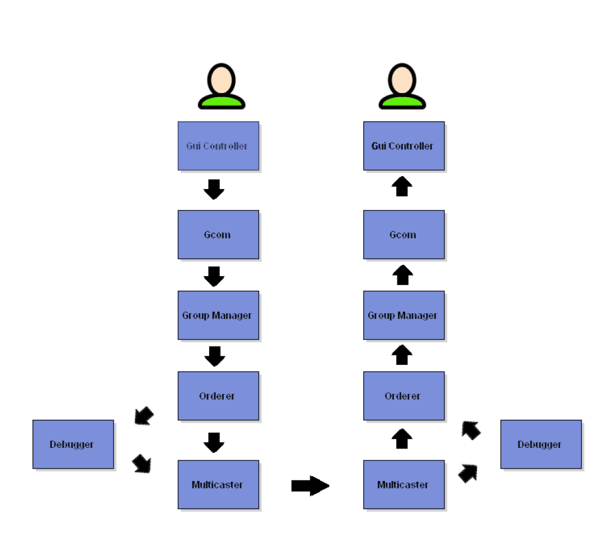
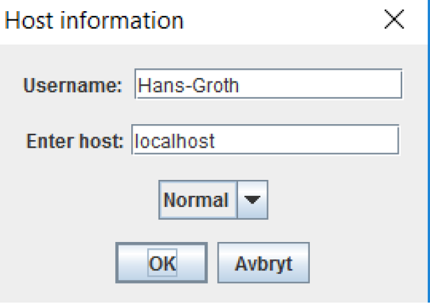
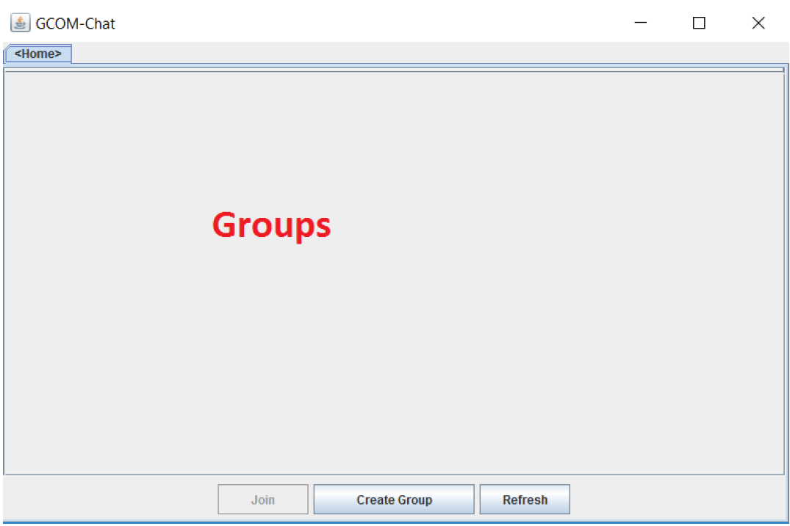
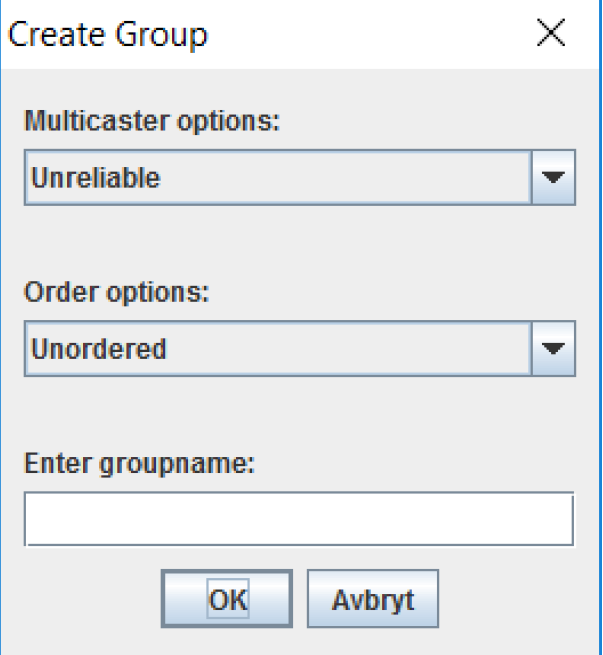
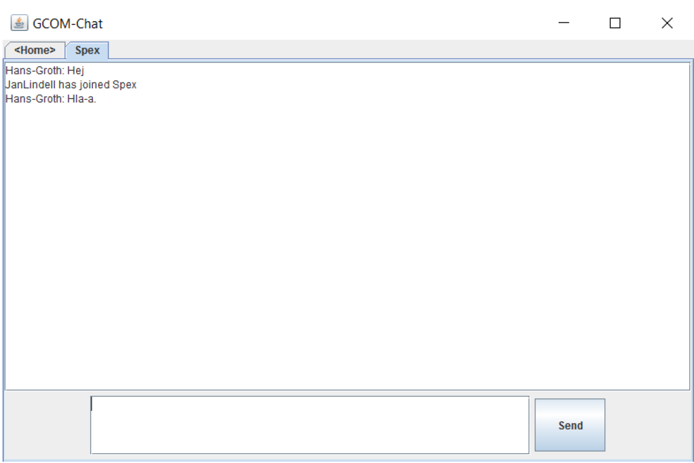
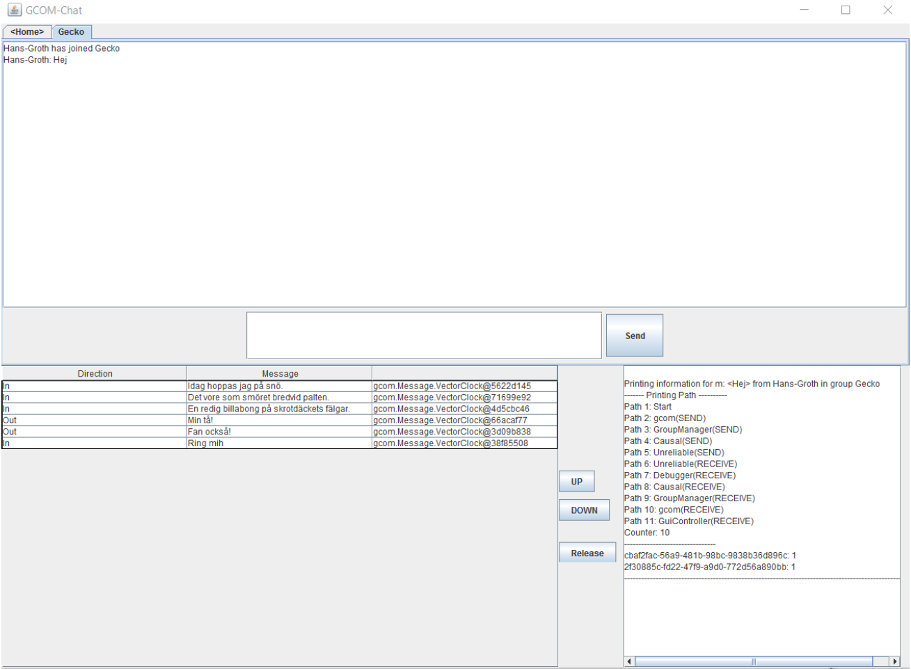

# Decentralized-Chat-App
Decentralized, except for a name server, chat application using common distributed algorithms. Includes GUI with group chat and debug functionality and ensures:

* Group management and chat functionality
* **Unreliable multicaster** communication
* **Unordered** and **Causal** ordering
* **Debug** functionality
* Graphical interface (Normal and Debug)





# Requirements:
Maven and Java 1.8+

# Install 
Execute build.sh
Generates NameServer.jar and ChatApp.jar

# Run

```
java -jar NameServer.jar
java -jar ChatApp.jar
```

# Usage












